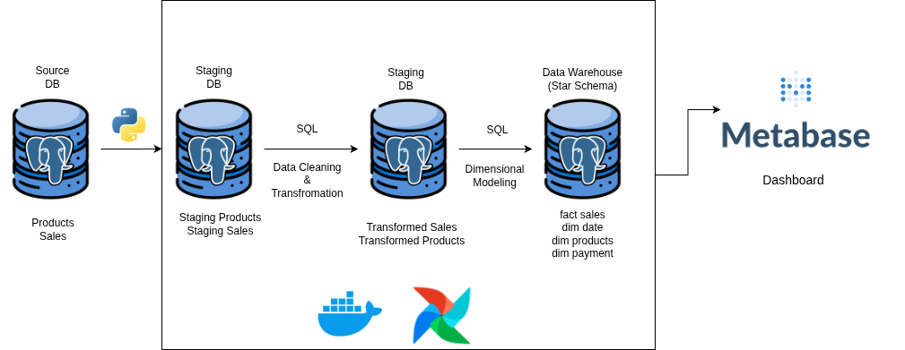
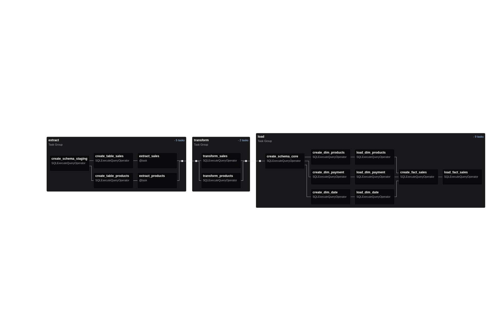
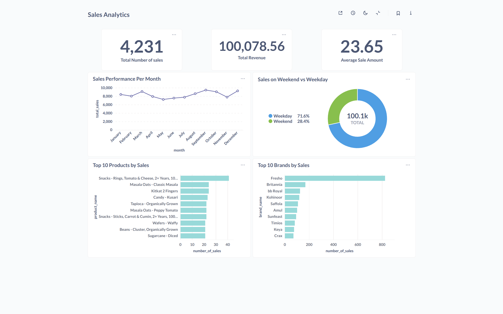

# E-Commerce ETL Pipeline

This project implements an ETL (Extract, Transform, Load) pipeline for an eCommerce dataset, processing raw data into a structured Data Warehouse (DWH). The pipeline is orchestrated using Apache Airflow and containerized with Docker, ensuring a reproducible and scalable environment.

## Architecture Diagram


## Airflow Dag


## 💻 Technologies Used

- **Python**: The primary language for all scripting, including the ETL logic
- **SQL**: Used extensively for data transformations within the staging and data warehouse environments
- **Docker**: Used to containerize the services (Airflow, PostgreSQL) and manage the project's environment
- **Apache Airflow**: The workflow management system that schedules and orchestrates the ETL tasks
- **PostgreSQL**: Serves as both the staging database and the final data warehouse
- **Metabase**: An open-source business intelligence tool used to create a dashboard for data visualization and analysis

## 📂 Data Architecture

The pipeline processes data from two source tables, `products` and `sales`, and loads them into a DWH following a star schema model.

### Staging Area

Raw data is first extracted from the source and loaded into a staging area within the PostgreSQL database. This is a temporary holding zone where data is cleaned and validated before transformation.

### Dimensional Modeling

The transformation step, executed primarily with SQL queries, converts the staged data into a dimensional model, which is optimized for analytics and reporting.

- **Fact Table**: `fact_sales` - Contains key metrics for each sale, such as quantity and total price
- **Dimension Tables**:
  - `dim_products` - Includes descriptive attributes for each product
  - `dim_date` - Provides time-based attributes (day, month, year) for temporal analysis
  - `dim_payment` - Stores details about the payment methods used

### Dashboarding

A dashboard was created using Metabase, connected to the PostgreSQL data warehouse. This dashboard provides key insights into sales performance, product trends, and other business metrics, allowing for easy data exploration.



## 🚀 Setup & Execution

### Prerequisites

Ensure you have Docker and Docker Compose installed on your system.

### Running the Pipeline

1. **Clone the repository:**
   ```bash
   git clone https://github.com/your-username/your-repo.git
   cd your-repo
   ```

2. **Start the services:**
   
   This command will build the Docker images and start the Airflow, PostgreSQL, and other necessary containers.
   ```bash
   docker-compose up -d
   ```

3. **Access Airflow UI:**
   - Open your web browser and navigate to http://localhost:8080 to access the Airflow user interface
   - **Username**: `airflow`
   - **Password**: `airflow`

4. **Trigger the DAG:**
   - In the Airflow UI, find the `eCommerce_etl` DAG
   - Toggle the DAG to **On**
   - Click the play button to manually trigger the pipeline

5. **Access Metabase:**
   - After the pipeline has completed, you can access the Metabase dashboard to view the data
   - Open your web browser and navigate to http://localhost:3000
   - Follow the setup wizard to connect Metabase to your PostgreSQL data warehouse
